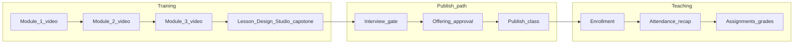
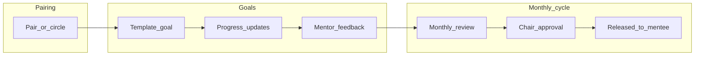
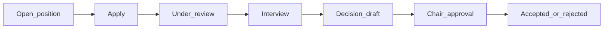

# Portal v1 workflow map (in-repo)

> Companion to [`portal-reliability-matrix.md`](portal-reliability-matrix.md). High-level flows and **blocked states** for QA and implementation. Last updated: 2026-03-29.

## Instructor pipeline

### Blocked states (instructor)

| State | User impact | Owning surfaces |
|--------|-------------|-----------------|
| Required module incomplete | Cannot finish training; publish blocked | `/instructor-training`, `/training/[id]` |
| Quiz not passed | Module incomplete | Training module actions |
| Evidence pending / revision / rejected | Readiness incomplete | Evidence queue (admin/chapter lead) |
| LDS draft not approved / not submitted | Capstone incomplete | `/instructor/lesson-design-studio` |
| Interview not `PASSED` / `WAIVED` | First publish blocked | Interview slots, admin readiness |
| Offering approval pending / changes requested / rejected | Publish blocked for that offering | Class offering settings, approval actions |
| Grandfathered offering | Publish allowed without full training | `ClassOffering.grandfatheredTrainingExemption` |

## Mentorship and goals

### Blocked states (mentorship)

| State | User impact | Owning surfaces |
|--------|-------------|-----------------|
| Pairing paused / inactive | Limited or no mentorship UX | Mentorship hub, pairing admin |
| Goal review draft | Chair queue not fed | Mentor review forms |
| `PENDING_CHAIR_APPROVAL` | Mentee cannot see final review | Chair approval actions |
| `CHANGES_REQUESTED` | Mentor must revise | Goal review workflow |

## Recruiting

### Blocked states (recruiting)

| State | User impact | Notes |
|--------|-------------|--------|
| Interview required but no completed slot + note | Decision blocked | See matrix §2.3 |
| Cross-chapter actions | 403 / hidden | Chapter president scope |
| `PENDING_CHAIR` decision | Applicant waits | No double approval |

## Chapter (single-chapter v1)

- Profile and stats → member directory → join request / approval → announcements → calendar and **RSVP** → pathway config (chapter-scoped).
- **Blocked:** user without `chapterId` may see empty chapter surfaces; join request pending vs approved must be clear in UI.

## Cross-cutting

- **Auth:** v1 = email/password, verification, reset; OAuth / magic link / 2FA deferred (routes may exist but not required for sign-off).
- **Feature flags:** `enabledFeatureKeys` in app layout — QA both on and off where applicable.
- **Multi-role:** primary role drives default experience; permissions = union of roles where implemented.

## Links

- Detailed steps: [`portal-reliability-matrix.md`](portal-reliability-matrix.md)
- Feature catalog: [`FEATURE_REFERENCE_TECHNICAL.md`](FEATURE_REFERENCE_TECHNICAL.md)
- Test tracker template: [`v1-test-tracker-template.md`](v1-test-tracker-template.md) (copy to Google Sheets)
